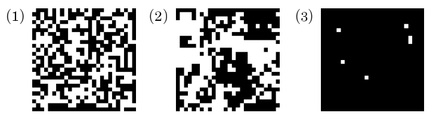

# Isingl_math

    (_)         (_)         (_)         (_)         (_)         (_)   
    (_)         (_)         (_)         (_)         (_)         (_)   
    (_)_       _(_)         (_) _  _  _ (_)         (_)_       _(_)   
      (_)     (_)           (_)(_)(_)(_)(_)           (_)     (_)     
       (_)   (_)     _  _   (_)         (_)  _  _      (_)   (_)      
        (_)_(_)     (_)(_)  (_)         (_) (_)(_)      (_)_(_)       
          (_)       (_)(_)  (_)         (_) (_)(_)        (_)         

  

<h1>Посилання для більш детального ознаймолення з матеріалом:</h1>

    https://learn.microsoft.com/ru-ru/azure/quantum/optimization-concepts-ising-model-for-optimization

Цей код моделює фізичну систему, відому як модель Ізінга. Модель Ізінга є простою математичною моделлю, яка досліджує поведінку магнітних спінів у двовимірній решітці.

Основний клас у цьому коді - IsingModel. При створенні об'єкта цього класу передаються два параметри: size (розмір решітки) та beta (параметр моделі). При ініціалізації створюється випадковий розподіл спінів (-1 або 1) на решітці.

<h1>Клас IsingModel має кілька методів:</h1>
<ul>
    <li>total_energy(): обчислює загальну енергію системи за допомогою формули моделі Ізінга.</li>
    <li>delta_energy(i, j): обчислює зміну енергії при зміні спіну у певному місці на решітці.</li>
    <li>gibbs_step(): виконує один крок алгоритму Гіббса для оновлення стану системи на основі ймовірностей переходів.</li>
    <li>simulate(steps): виконує задану кількість кроків симуляції, викликаючи gibbs_step() для кожного кроку. Повертає кінцевий стан системи.</li>
</ul>

У головній частині коду (if __name__ == '__main__':) виконується симуляція для різних значень параметру beta. Після кожної симуляції результат відображається за допомогою plt.imshow(), а також додаються ефекти "cyberpunk" за допомогою mplcyberpunk.add_glow_effects().

Цей код демонструє базову реалізацію моделі Ізінга та візуалізацію кінцевого стану системи для різних параметрів beta

                                                                     

